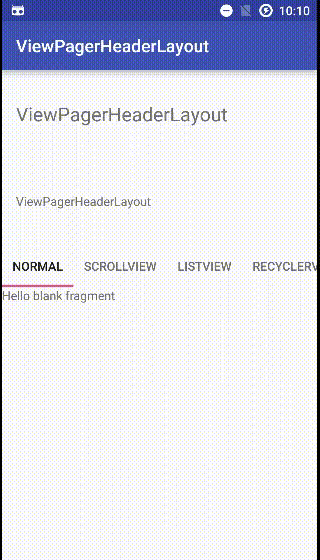

可以在ViewPager上添加Header的layout
#ScreenShot

#使用方法
```xml
<com.sw926.viewpagerheaderlayout.ViewPagerHeaderLayout
    android:layout_width="match_parent"
    android:layout_height="match_parent">

    <LinearLayout
        android:id="@id/vhl_header"
        android:layout_width="match_parent"
        android:layout_height="wrap_content"
        android:orientation="vertical">
		...
    </LinearLayout>

    <RelativeLayout
        android:id="@id/vhl_content"
        android:layout_width="match_parent"
        android:layout_height="match_parent">

        <android.support.design.widget.TabLayout
            android:id="@+id/tabs"
            app:tabMode="scrollable"
            android:layout_width="match_parent"
            android:layout_height="wrap_content" />

        <android.support.v4.view.ViewPager
            android:id="@id/vhl_viewpager"
            android:layout_width="match_parent"
            android:layout_height="match_parent"
            android:layout_below="@id/tabs" />
    </RelativeLayout>
</com.sw926.viewpagerheaderlayout.ViewPagerHeaderLayout>
```
#可能遇到的问题
为了支持SwipeRefreshLayout，继承了NestedScrollingChild，实现isNestedScrollingEnabled，返回true，但是没有实现NestedScrollingChild的其他接口，用在NestedScrollingParent中可能会出现问题